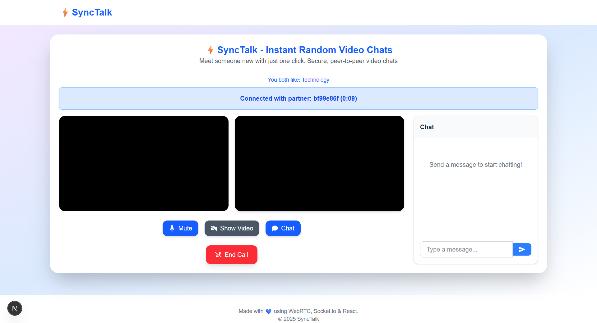

# About SyncTalk

SyncTalk is an innovative random video chat platform that connects people based on shared interests in a secure, anonymous environment.

## Screen Shots

## Key Features

- **Interest-Based Matching** - Connect with people who share your hobbies
- **Secure P2P Video** - End-to-end encrypted video chats
- **Anonymous Interactions** - No personal information required
- **Real-Time Chat** - Text chat alongside video

## How It Works

1. Select your interests from our categories
2. Get matched with a random partner
3. Video chat anonymously
4. Choose to continue or end the conversation

## Technology Stack

- **Frontend**: Next JS, TypeScript, Tailwind CSS
- **Backend**: Node.js, Socket.io
- **WebRTC**: Peer-to-peer video streaming

## Community Guidelines

- Be respectful to all users
- No explicit content or harassment
- Keep personal information private
- Report any inappropriate behavior